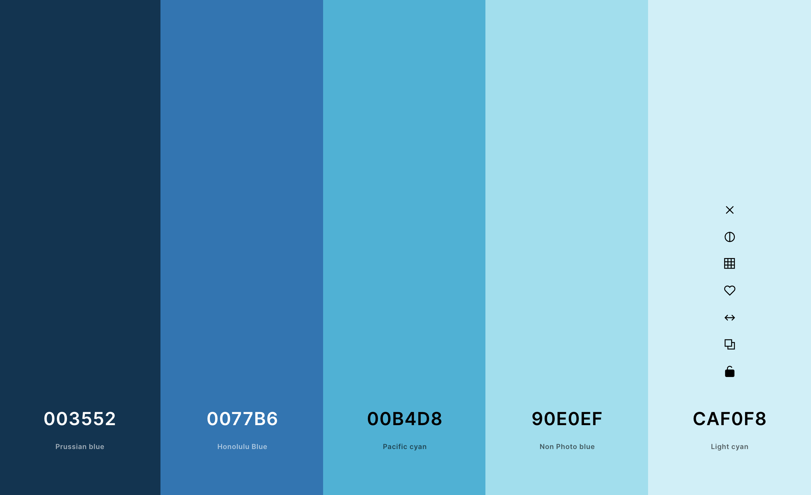

# Main Design Doc
## Color Pallette 

### Primary Background: 
    #CAF0F8
### Primary Foreground:
    #00B4D8
### Accent Primary:
    #0077B6
### Background Accent:
    #003552

## Font

### Font Family:
#### Roboto

    CSS Import: @import url('https://fonts.googleapis.com/css2?family=Roboto:ital,wght@0,100;0,300;0,400;0,500;0,700;0,900;1,100;1,300;1,400;1,500;1,700;1,900&display=swap');

## Design Stylings: 
### See stylePrototype.css
