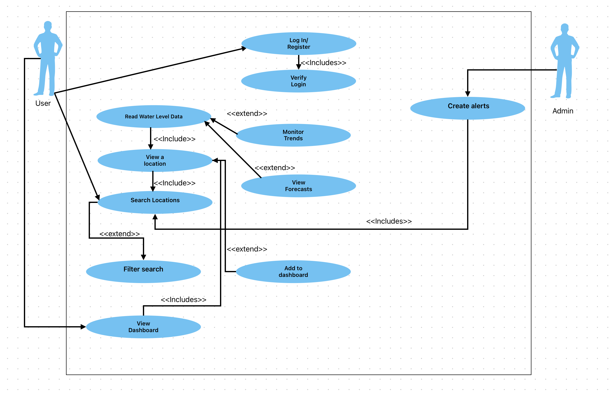
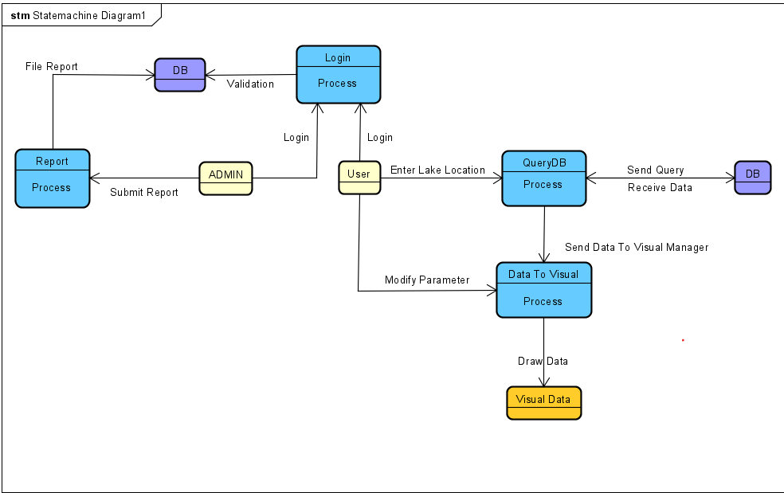
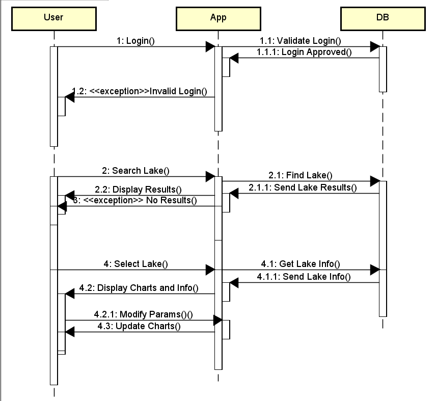
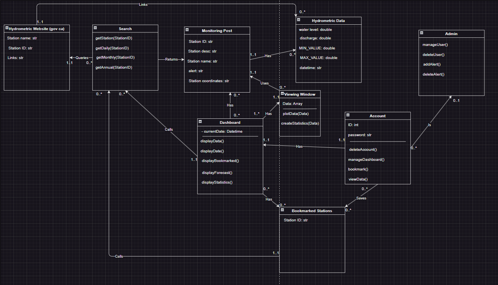

# Intercal
 COSC310 Group project
Group Members:
- Adam Badry
- Oakley Pankratz
- Nic Kouwenhoven
- Jayden Jayawardhena

## Project Descciption:
Our Group goal with this prject is to help make a useful research tool for people looking into water levels in canadian lakes and rivers. By using evironment Canadas data, and creating a tool to visualize data, and track lake performance in real time and flag potential issues with lake levels.

## User Requirements:

- Search for lakes based on ID or lake levels
- View Lake data
- View Lake predictions
- Allow users to add lakes to their dashboard
- Allow Admin to flag lakes in the database
- Allow Users to create Accounts

## System Requirements

### Functional Requirements:

- Query the database for lakes with specific Id's or water level ranges
- Display current lake data within a dashboard citing the monitoring posts it sources
- Display Average lake levels within a specific time period to estimate the levels for a year
- link lakes to a users dashboard within the database so it is saved between devices not just on the client
- Allow Admin to assign a flag to lakes out of acceptable values within a database
- Add users to databases according to their input


### Non-Functional Requirements

- The system must Store and organize water level data
- predictions must be processed on the client-side
- data visualization happens on the client side
- maintain Flagged lakes and monitoring posts
- Store Users, and user dashboards on the server
- respond to queries in a reasonable amount of time
- link to sourced data for visualization and predictions and previous years, to openly display facts

## User Stories
 - As a user, I want to get visualizations for lake data so that I can gain an understanding of water annual water flows in a given area
 - As a admin, I want to flag issues with lakes I come across.
 - As a admin, I want the system to show lakes with potential issues
 - As a user, I want to be able to sign into an account
 - As a user, I want a to be able to filter lakes based on names, lakes, or water levels
 - As a user, I want to be able to save certain lakes to my dashboard for convenient analysis
 - As a user, I want to be able to manage my personal dashboard in order to edit or remove certain elements
 - As a user, I want to see a forecast for what the lake data will look like.

## User Use Case Diagram:



## UML Data Diagram:


## UML Class Diagram:


## Data Flow Diagram:



# Sequence Diagram:


## Class Diagram:


# Test Plan

## Introduction
We will be using the Mocha framework to test our Node.js functions and methods to ensure that our code is error-free. Mocha is well-known for it's unit testing and integration testing, and will allow us to efficiently write test cases for our code, reducing overall code bloat and wasted time.

We will be aiming for 85-100% code coverage with our unit testing, allowing us to ensure that our test cases cover the majority of functionality in our code base.

The overall aim for our test plan is to produce code that executes as expected every time.

## Scope
The scope for our tests involves everything to do with the core functionality of our project, including searching lakes, changing parameters, marking posts to follow, saving user view

The scope does not involve login and registration

## Testing Approaches
### Front-end:
Testing the front-end components will involve unit testing, integration testing and UI testing.
Tests will follow the order: Unit Tests -> Integration Tests -> UI Tests
UI testing will follow a few rules:
1. Create small tests:
This involves testing the smaller elements of the web page rather than testing the entire web app itself in one single test.
2. Use dedicated tests:
To account for all of the elements on a webpage, we will use structured tests to ensure that elements are not missed.

Instead of simply looking at the webpage to determine the accuracy of our UI, we will be asking questions such as:
"Is the element of the right size?"
"Is the element nested correctly?"
"Do all elements maintain the broad structure of the webpage?"

### Back-end:
Testing the server will involve ensuring that connections are handled properly (statusCode 200 is outputted on function call)
Testing the javascript functions will involve unit testing functions to ensure they are providing the correct return values and outputs for a given set of inputs from the user

### Overall:
Aside from automated testing, we will be performing code reviews and design reviews when a team member updates the main branch. This will allow us to increase optimization, reduce errors, and provide input or feedback if something can be done a better way.
Testing everything will involve integration testing using a CI/CD pipeline in Github. This will run tests every time a change is made on the main branch, allowing us to ensure that our code runs after every iteration of our main codebase.

### Current:
Currently, as we have just begun implementing code, we do not have the CI/CD tests in place so we are all doing manual unit testing with our code as well as manual tests to ensure we have integrated different components successfully.

### Future:
Future tests will be written to ensure functionality according to our pre-defined user stories. These tests will aim to cover 85-100% of the code base.

We will be following BDD (Behaviour Driven Development), which is a refined version of TDD (Test Driven Development), focused on the user experience. Due to this, unit testing will become a part of the implementation cycle, and will happen before the actual code is written. This will ensure that our written code is providing the expected output, cutting down on errors that may arise in the future.

Along with unit testing will be integration testing, where we will test the system as a whole after each major step to ensure seamless integration with the rest of the system.

We will be using a CI/CD pipeline in Github Actions to run all of our tests when changes are made to the main branch to ensure our integration testing is followed adequately.

## Roles
Each user will be in charge of writing their unit tests, although each member can write them if they notice tests are lacking.

Nic will be in charge of setting up the initial CI/CD pipeline so that the team can add their tests to Github in order to ensure integration tests are successful when new changes are made.

# Coding Design Practices

## Planned patterns

### Abstract Factory pattern
As we are using react, it does heavily lean into this style for objects as each object created can be classed differently or built differently depending on the context. This Can be best seen in our info fragments, that all share the same design but contain different data. We chose to do this design pattern as it is most effective for code reusability and effectiveness in maintaining design standards

### Adapter Pattern
As we are dealing with an external api for our sensor data, we are relying heavily on the adaptation of data to fit cleanly into our functions and produce usable results. we decided to do this because by adapting the data we will be better able to visualize and manipulate it.

## Anti-pattern Avoidance Techniques/Practices
### Code Cleanliness and readability
    this refers to the ease of review and documentation of solutions

#### Never Nest 
    By never nesting beyond one or two nested levels, we can force our code to become more readable as a result. For example if statements inside of if statements inside of if statements are very useless, and can often be completely negated by using seperate more concise 

### Effective debugging
    effective debugging refers to the ease of determining faults in code. We can increase this with: 

#### Functional Programming
    By creating functions that can be named and properly tested we can cut down on large debugging tests simply by breaking every problem down to its core and testing each specific function. This helps us 

##### Functional programming also aids in restricting an objects functional access within memory, increasing security and preventing the creation of God Class Objects

### God Classes
    Refers to the creation of code that can do or knows too much. This is a probl;em because it decreases security and increases instability in a system. This is because if the class fails it brings the service down with it

### Functional programming
    Functional programming very much stands to aid in the destruction of God classes by emphasizing the usage of new classes for different functionality. Functional programmers are also know for killing God and space complexity with their practices, but with the correct time and place single purpose design practices create great software. Creating objects that are only used for a specific task, no general solutions

## Planned Pattern Usage

### Structural:

#### In addition to the design patterns listed in the Anti-design pattern avoidance techniques, these are the patterns we will employ in order to actively strive for great and consistent design. 

#### Creational: 
    For the creation of new objects in our webapp, we have decided to use factory practices in order to create object that can easily be manipulated by the Model View Controller model

#### Structural:
    For our Structural patterns we wanted to use a combination of MVC and component based architecture. The benefits of this approach being that data is secure and we can easily create general components that can easily be reused for any object we pass to it and in multiple views. 

#### Behavioral:

    For our behavior we have chosen to stick with a protocol stack, where communications are handled linearly in order to maintain stability and ease of maintenance. We thought this would work best as if we wanted to add more functionality the integrity of our data does not hinge on a system bringing it into the app expecting a certain format. We also have very little reason to obfuscate how our data is recieved or how the system functions.
 
# Main Design Doc
## Color Pallette 

### Primary Background: 
    #CAF0F8
### Primary Foreground:
    #00B4D8
### Accent Primary:
    #0077B6
### Background Accent:
    #003552

## Font

### Font Family:
#### Roboto

    CSS Import: @import url('https://fonts.googleapis.com/css2?family=Roboto:ital,wght@0,100;0,300;0,400;0,500;0,700;0,900;1,100;1,300;1,400;1,500;1,700;1,900&display=swap');


## Design Stylings: 
### See stylePrototype.css

# Server setup

In order to properly setup the server to be used in testing, the following must be done:

Ensure docker is installed.

Navigate to the server folder, this has the file **docker-compose.yml**

run the following commands in your terminal:

```shell
docker compose up -d
```

```shell
docker exec -it mysql-intercal bash
```

```console
mysql -u root -p
```
you will then enter the password for the root user ("rootpw" by default),

then press enter.

run the final commands:
```console
use maindb
```

```console
source docker-entrypoint.initdb.d/init.sql
```

If everything worked, your local database should haave all the neccesary tables and entries.


#### You can close your server either from docker or from your terminal:
```
docker compose down
```
