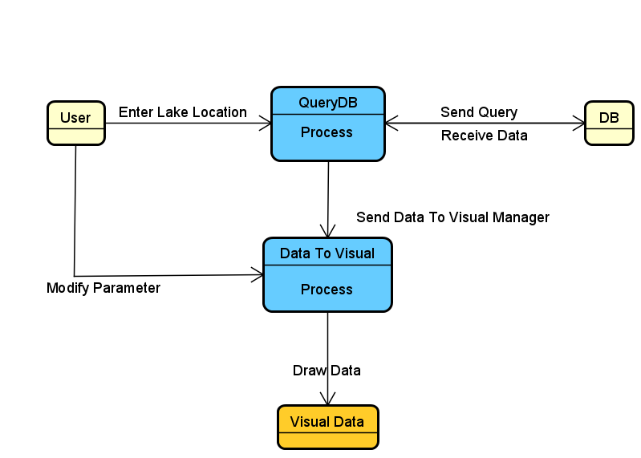

# Intercal
 COSC310 Group project  
Group Members:  
- Adam Badry
- Oakley Pankratz
- Nick kouwenhoven
- Jayden Jayawardhena  

## Project Descciption: 
Our Group goal with this prject is to help make a useful research tool for people looking into water levels in canadian lakes and rivers. By using evironment Canadas data, and creating a tool to visualize data, and track lake performance in real time and flag potential issues with lake levels. 

## User Requirements:

- View Lake data
- View Lake predictions
- Allow users to add lakes to their dashboard
- Allow Admin to flag lakes in the database
- Allow Users to create Accounts

## Functional Requirements:

- Tracking Changes over time
- Visualize data
- Show Predictions for water levels

## Non-Functional Requirements

- Store and organize water level data
- Store Flagged lakes and monitoring posts
- Store User dashboards on the server
- respond to queries in a timely manner
- link to sourced data for visualization and predictions

## User Use Case Diagram:

  
## UML Data Diagram:

  
## UML Class Diagram:

## Data Flow Diagram:

